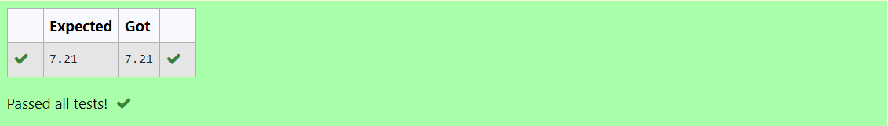

# DISTANCE-BETWEEN-TWO-POINTS

## AIM:
To write a python program to find the distance two 2 points
## ALGORITHM:
### Step 1: 
### Step 2: 
### Step 3: 
Substitute the values in the distance formula  
### Step 4: 
### Step 5: 
### PROGRAM:
```
#Program to find the distance between two points.
#Developed by: Sabeeha Shaik
#RegisterNumber:v 23012003
import math
x1 = 10
x2 = 4
y1 = 6
y2 = 2
d = math.sqrt(((x2-x1)**2 + (y2 - y1)**2))
print("%.2f" % d)
```
  


### OUTPUT:


### RESULT:
